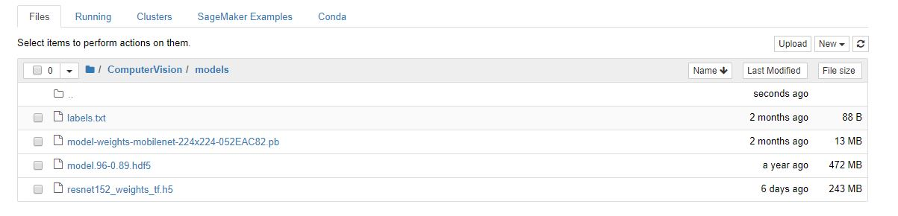

# SmartVision
this is for grab aiforsea under computer vision challange

USGAE:

download test/train data

```bash
$ cd ComputerVision
$ wget http://imagenet.stanford.edu/internal/car196/cars_train.tgz

$ wget http://imagenet.stanford.edu/internal/car196/cars_test.tgz

$ wget --no-check-certificate https://ai.stanford.edu/~jkrause/cars/car_devkit.tgz
```

please download the following models to models/ folder

```bash
$ cd ComputerVision/models
```
Model moilenet weights:
```bash
$ wget https://drive.google.com/open?id=1W3YXmnfVH7mHHbGMSpgecKI_twRE24lg
```
Model Fine tune Rsnet152:
```bash
$ wget https://drive.google.com/open?id=1bjJwDKvWMsuy1wEDQNAMz4Mw2QenYZQb
```
Model Fine tune Rsnet152 tf weights:
```bash
$wget https://drive.google.com/open?id=1wjiD8ujWOIzIThGX58x7ICk9HkkrOnVB
```


envinorment fie: env.yml

please run the preprocessing script: Extract 8,144 training images, and split them by 80:20 rule (6,515 for training, 1,629 for validation):

```bash
$ python pre-process.py
```
for demo:
```bash
$ python main.py -h # for help

$ python main.py -f 00002.jpg #look for specific image in data/test folder
```
returns result.json file in project directory

```bash
$ python main.py --randomimage --size 10 # validation aganist random 10 images in data/test folder

##train:
$ python train.py
```
```bash
#Analysis:
$ python analyze.py

#valiation:
$ python test.py
```


